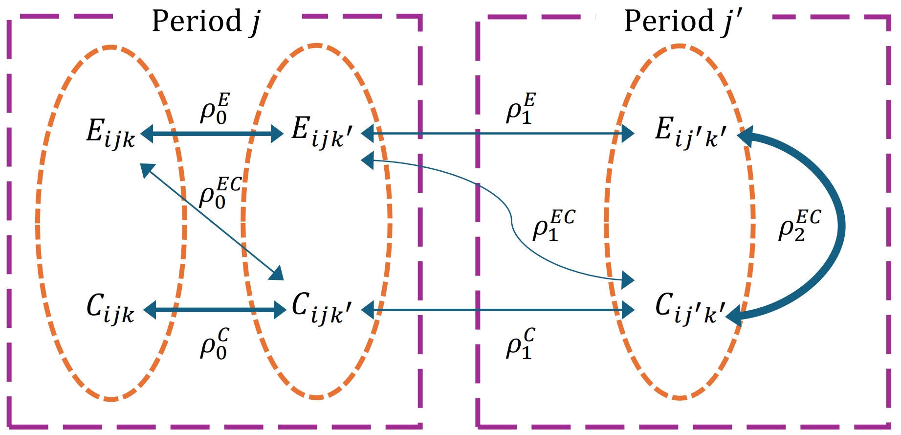
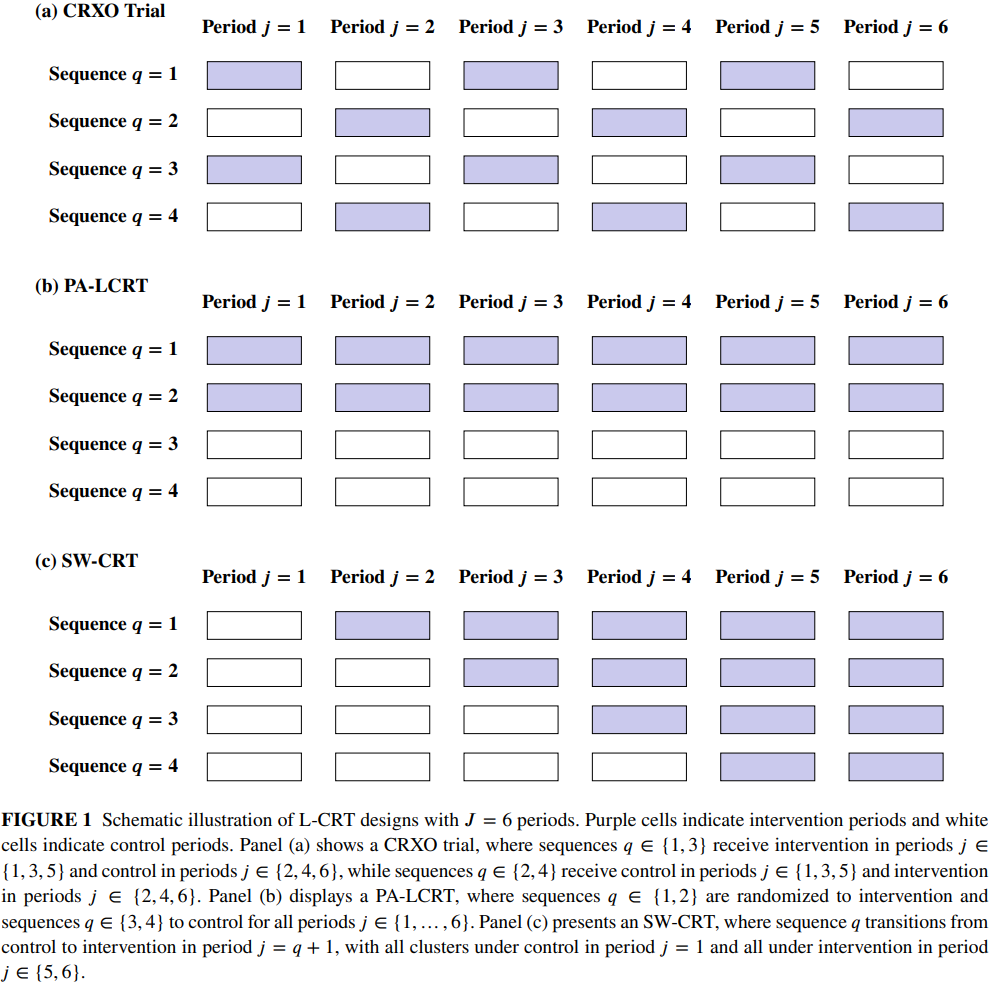

# Optimal Sample Size Calculation in Cost-Effectiveness Longitudinal Cluster Randomized Trials

This repository contains the R code to reproduce the results presented in [Optimal Sample Size Calculation in Cost-Effectiveness Longitudinal Cluster Randomized Trials](TBD).

### Graphical Representation of the Data Structure

The bivariate linear mixed model induces seven ICCs under a nested exchangeable correlation structure:

  

Each dashed oval represents an individual observed in a period (dashed square) nested in the cluster, with both a clinical outcome ($E$) and cost ($C$) measured per individual. Arrows depict the ICCs corresponding to within-period correlations ($\rho_0^E$, $\rho_0^C$), between-period correlations ($\rho_1^E$, $\rho_1^C$), and three types of between-outcome correlations ($\rho_0^{EC}$, $\rho_1^{EC}$, $\rho_2^{EC}$). The width of each arrow indicates the relative strength of correlation under the following constraints: (i) $\rho_1^E \leq \rho_0^E$; (ii) $\rho_1^C \leq \rho_0^C$; (iii) $\rho_0^{EC} \leq \min(\rho_0^E, \rho_0^C)$; (iv) $\rho_1^{EC} \leq \min(\rho_1^E, \rho_1^C)$; and (v) $\rho_1^{EC} \leq \rho_0^{EC} \leq \rho_2^{EC}$.

| Type | ICC | Description |
|------|-----|-------------|
| Outcome-specific | $\rho_0^E$ | Within-period effect ICC |
| | $\rho_0^C$ | Within-period cost ICC |
| | $\rho_1^E$ | Between-period effect ICC |
| | $\rho_1^C$ | Between-period cost ICC |
| Between-outcome | $\rho_0^{EC}$ | Within-period effect–cost ICC |
| | $\rho_1^{EC}$ | Between-period effect–cost ICC |
| | $\rho_2^{EC}$ | Within-individual effect–cost ICC |

### Acronyms

* **L-CRT**: Longitudinal cluster randomized trial
* **PA-LCRT**: Parallel-arm longitudinal cluster randomized trial
* **CRXO**: Cluster randomized crossover trial
* **SW-CRT**: Stepped-wedge cluster randomized trial
* **LOD**: Local optimal design
* **MMD**: Maximin design
* **INMB**: Incremental net monetary benefit
* **ICC**: Intracluster correlation coefficient
* **CAC**: Cluster autocorrelation coefficient
* **RE**: Relative efficiency

### Overview

An illustration of three L-CRT design variants with $J = 6$ periods:

  

### Quickstart

To reproduce the results, please download this repo on a machine with R, run each R script in the [`codes`](codes) directory without modification, and then the results are saved in [`figures`](figures). To generate tables in the main paper, please run the scripts in [`tables`](tables). All the R scripts can be run standalone. To run the R scripts, you do not need to set any pathnames; everything is relative.

Required R packages: dplyr, ggh4x, ggplot2, nloptr, patchwork, tidyr, xtable.

### Compute Optimal Designs

Run our [`Shiny App`](https://f07k8s-hao-wang.shinyapps.io/Cost-effectiveness_LCRT/) to find optimal sample sizes for cost-effectiveness L-CRTs:

A step-by-step tutorial with worked examples is provided in Web Appendix D of the paper.

### Generate Tables and Figures

#### LODs for CRXO Trials and PA-LCRTs (Table 2)

* Run [`table_2_LOD_CRXO.R`](tables/table_2_LOD_CRXO.R) and [`table_2_LOD_PA.R`](tables/table_2_LOD_PA.R)
  + LODs under varying ICC and design parameters for CRXO trials and PA-LCRTs with $J = 2, 4, 6$ periods

#### MMDs for CRXO Trials and PA-LCRTs (Table 3)

* Run [`table_3_MMD_CRXO.R`](tables/table_3_MMD_CRXO.R) and [`table_3_MMD_PA`](tables/table_3_MMD_PA.R)
  + MMDs under varying parameter space specifications for CRXO trials and PA-LCRTs with $J = 2, 4, 6$ periods

#### LODs and MMDs for SW-CRTs (Tables 4 and 5)

* Run [`table_4_LOD_SWCRT.R`](tables/table_4_LOD_SWCRT.R) and [`table_5_MMD_SWCRT.R`](tables/table_5_MMD_SWCRT.R)
  + LODs and MMDs for SW-CRTs with $Q = 3, 5, 7$ treatment sequences

#### LODs With Varying CAC (Figure 2)

* Run [`figure_3_LOD.R`](codes/figure_3_LOD.R)
  + LODs for CRXO trials, PA-LCRTs, and SW-CRTs with varying cluster autocorrelation (CAC) when $J = 4$
  + generate [`figure_3.pdf`](figures/figure_3.pdf)

#### LODs With Varying Standardized Ceiling Ratio (Web Figure 1)

* Run [`web_figure_S4_LOD_varying.R`](codes/web_figure_S4_LOD_varying.R)
  + LODs for CRXO trials, PA-LCRTs, and SW-CRTs with $\lambda r = 0.1, 1, 2$ when $J = 4$
  + generate [`web_figure_s4.pdf`](figures/web_figure_s4.pdf)

#### MMDs With Varying Maximum Between-Period Effect ICC (Figure 3)

* Run [`figure_4_MMD.R`](codes/figure_4_MMD.R)
  + MMDs for CRXO trials, PA-LCRTs, and SW-CRTs with varying $\rho_{1,\max}^E$ when $J = 4$
  + generate [`figure_4.pdf`](figures/figure_4.pdf)

### Helper Functions

The following scripts in [`codes`](codes) contain helper functions used in the analysis. These are automatically sourced by the main scripts — you do not need to run them separately:

* `utils_PA.R`: variance calculation and LOD/MMD optimization for parallel-arm LCRTs
* `utils_CRXO.R`: variance calculation and LOD/MMD optimization for cluster randomized crossover trials
* `utils_SWCRT.R`: variance calculation and LOD/MMD optimization for stepped-wedge CRTs
